# Codebase Architecture Map

## Class List

- App\Bootstrap
- App\Console\Command\ImportUserHistoryCommand
- App\Console\Command\SearchReindexCommand
- App\Console\Command\SearchTestCommand
- App\Console\Command\SyncScrapeProductsCommand
- App\Console\Command\TestPromoteCommand
- App\Core\RouterFactory
- App\Core\Logger\DatabaseLogger
- App\Entity\UserEntity
- App\Model\Catalog\Dto\FacetGroup
- App\Model\Catalog\Dto\FacetItem
- App\Model\Catalog\Dto\ProductSearchRequest
- App\Model\Catalog\Dto\ProductSearchResult
- App\Model\Catalog\Entity\Artist
- App\Model\Catalog\Entity\ArtistAlias
- App\Model\Catalog\Entity\DiscogsArtist
- App\Model\Catalog\Entity\Ean2DiscogsId
- App\Model\Catalog\Entity\Genre
- App\Model\Catalog\Entity\GenreAlias
- App\Model\Catalog\Entity\MasterArtist
- App\Model\Catalog\Entity\MasterGenre
- App\Model\Catalog\Entity\Product
- App\Model\Catalog\Entity\ProductVariant
- App\Model\Catalog\Entity\Supplier
- App\Model\Catalog\Exception\UnmappedGenreException
- App\Model\Catalog\Repository\Ean2DiscogsIdRepository
- App\Model\Catalog\Repository\ProductRepository
- App\Model\Catalog\Repository\SupplierRepository
- App\Model\Catalog\Search\ManticoreClient
- App\Model\Catalog\Search\ProductIndexer
- App\Model\Catalog\Search\ProductSearchService
- App\Model\Catalog\Service\ArtistResolver
- App\Model\Catalog\Service\GenreResolver
- App\Model\Catalog\Service\PriceCalculator
- App\Model\Catalog\Service\ProductPromoter
- App\Model\Catalog\Service\SlugGenerator
- App\Model\Catalog\Service\GenreResolverInterface
- App\Model\Core\Entity\Log
- App\Model\Core\Repository\LogRepository
- App\Model\Factory\Anonymous
- App\Model\Factory\DatagridFactory
- App\Model\Factory\FormFactory
- App\Model\Factory\LangFormFactory
- App\Model\Factory\MailerFactory
- App\Model\Fixtures\GenreFixture
- App\Model\Fixtures\OrderFixture
- App\Model\Fixtures\ProductFixture
- App\Model\Fixtures\ScrapeProductFixture
- App\Model\Fixtures\SupplierFixture
- App\Model\Fixtures\UserFixture
- App\Model\Inventory\DTO\BulkReceiveItemData
- App\Model\Inventory\DTO\CreateStockItemFromScanData
- App\Model\Inventory\DTO\ReceiveStockItemData
- App\Model\Inventory\DTO\StockProductSummary
- App\Model\Inventory\Entity\ReceivingBatch
- App\Model\Inventory\Entity\ReceivingBatchItem
- App\Model\Inventory\Entity\StockItem
- App\Model\Inventory\Facade\ReceivingBatchFacade
- App\Model\Inventory\Facade\StockReceivingFacade
- App\Model\Inventory\Repository\ReceivingBatchRepository
- App\Model\Inventory\Repository\StockItemRepository
- App\Model\Order\DTO\CreateOrderCustomerData
- App\Model\Order\DTO\CreateOrderData
- App\Model\Order\DTO\CreateOrderItemData
- App\Model\Order\DTO\OrderListItem
- App\Model\Order\DTO\OrderSplitData
- App\Model\Order\Entity\Order
- App\Model\Order\Entity\OrderAdjustment
- App\Model\Order\Entity\OrderItem
- App\Model\Order\Entity\OrderItemSnapshot
- App\Model\Order\Facade\CreateOrderFacade
- App\Model\Order\Facade\OrderSplitFacade
- App\Model\Order\Repository\OrderRepository
- App\Model\Scraping\PoolHealthDTO
- App\Model\Scraping\ProxyDTO
- App\Model\Scraping\ProxyPoolService
- App\Model\Scraping\Client\ScraperClient
- App\Model\Scraping\Client\ScraperClientException
- App\Model\Scraping\Entity\ScrapeJob
- App\Model\Scraping\Entity\ScrapeProduct
- App\Model\Scraping\Entity\ScrapeResult
- App\Model\Scraping\Entity\ScrapeSource
- App\Model\Scraping\Exception\BlockedException
- App\Model\Scraping\Generator\JobGenerator
- App\Model\Scraping\Storage\HtmlStorage
- App\Model\Scraping\Strategy\MedimopsStrategy
- App\Model\Scraping\Strategy\SupplierStrategyRegistry
- App\Model\Scraping\Strategy\WobStrategy
- App\Model\Scraping\Strategy\SupplierStrategyInterface
- App\Model\Scraping\Worker\JobProcessor
- App\Model\User\Entity\Address
- App\Model\User\Entity\User
- App\Model\User\Entity\UserGroup
- App\Model\User\Entity\UserProfile
- App\Model\User\Exception\DuplicateEmailException
- App\Model\User\Exception\UserBannedException
- App\Model\User\Facade\RegistrationData
- App\Model\User\Facade\UserAdminFacade
- App\Model\User\Facade\UserProfileFacade
- App\Model\User\Facade\UserRegistrationFacade
- App\Model\User\Factory\UsersGridFactory
- App\Model\User\Repository\AddressRepository
- App\Model\User\Repository\UserRepository
- App\Model\User\Service\Authenticator
- App\Model\User\Service\NewUserMailer
- App\Model\User\Service\PasswordService
- App\Presentation\Accessory\BootstrapHorizontalRenderer
- App\Presentation\Accessory\BootstrapRenderer
- App\Presentation\Accessory\LatteExtension
- App\Presentation\Admin\BaseAdminPresenter
- App\Presentation\Admin\Dashboard\DashboardPresenter
- App\Presentation\Admin\Log\LogPresenter
- App\Presentation\Admin\Log\Factory\LogGridFactory
- App\Presentation\Admin\Orders\OrdersPresenter
- App\Presentation\Admin\Procurement\ProcurementPresenter
- App\Presentation\Admin\Products\ProductsPresenter
- App\Presentation\Admin\Products\Factory\ProductGridFactory
- App\Presentation\Admin\Receiving\ReceivingPresenter
- App\Presentation\Admin\Stock\StockPresenter
- App\Presentation\Admin\Users\UsersPresenter
- App\Presentation\Admin\Users\Factory\AddressFormFactory
- App\Presentation\Error\Error4xx\Error4xxPresenter
- App\Presentation\Error\Error5xx\Error5xxPresenter
- App\Presentation\Front\BaseFrontPresenter
- App\Presentation\Front\Home\HomePresenter
- App\Presentation\Front\Login\LoginFormFactory
- App\Presentation\Front\Login\LoginPresenter
- App\Presentation\Front\Register\RegisterFormFactory
- App\Presentation\Front\Register\RegisterPresenter
- App\Service\OrderService
## Namespace: `App`

### Class: `Bootstrap`

**Public Methods:**

- `__construct(): void`
- `bootWebApplication(): Nette\DI\Container`
- `bootForCLI(): Nette\DI\Container`
- `initializeEnvironment(): void`

---

## Namespace: `App\Console\Command`

### Class: `ImportUserHistoryCommand`

**Public Methods:**

- `__construct(UserRepository $userRepository, AddressRepository $addressRepository, OrderRepository $orderRepository): void`

---

### Class: `SearchReindexCommand`

**Public Methods:**

- `__construct(ProductIndexer $indexer): void`

---

### Class: `SearchTestCommand`

**Public Methods:**

- `__construct(ProductSearchService $searchService, ManticoreClient $manticoreClient): void`

---

### Class: `SyncScrapeProductsCommand`

**Public Methods:**

- `__construct(ProductPromoter $promoter, EntityManagerInterface $em): void`

---

### Class: `TestPromoteCommand`

**Public Methods:**

- `__construct(ProductPromoter $promoter, EntityManagerInterface $em): void`

---

## Namespace: `App\Core`

### Class: `RouterFactory`

**Public Methods:**

- `createRouter(): RouteList`

---

## Namespace: `App\Core\Logger`

### Class: `DatabaseLogger`

**Public Methods:**

- `__construct(LogRepository $logRepository): void`
- `log(mixed $level, string|Stringable $message, array $context): void`
- `emergency(string|Stringable $message, array $context): void`
- `alert(string|Stringable $message, array $context): void`
- `critical(string|Stringable $message, array $context): void`
- `error(string|Stringable $message, array $context): void`
- `warning(string|Stringable $message, array $context): void`
- `notice(string|Stringable $message, array $context): void`
- `info(string|Stringable $message, array $context): void`
- `debug(string|Stringable $message, array $context): void`

---

## Namespace: `App\Entity`

### Class: `UserEntity`

**Properties:**

- `private int $id`
- `protected string $email`
- `public string $name`

**Public Methods:**

- `getId(): int`

---

## Namespace: `App\Model\Catalog\Dto`

### Class: `FacetGroup`

**Public Methods:**

- `__construct(string $name, array $items): void`

---

### Class: `FacetItem`

**Public Methods:**

- `__construct(string $value, int $count, ?string $label): void`

---

### Class: `ProductSearchRequest`

**Public Methods:**

- `__construct(?string $query, ?ProductCategory $category, ?ProductMediaType $mediaType, ?ProductCondition $condition, ?int $artistId, ?int $genreId, ?float $priceMin, ?float $priceMax, ?int $yearFrom, ?int $yearTo, bool $inStockOnly, string $sortBy, int $page, int $limit): void`
- `fromArray(array $data): self`
- `getOffset(): int`

---

### Class: `ProductSearchResult`

**Public Methods:**

- `__construct(array $products, int $totalCount, array $facets, array $productIds): void`
- `isEmpty(): bool`
- `getPageCount(int $limit): int`

---

## Namespace: `App\Model\Catalog\Entity`

### Class: `Artist`

**Properties:**

- `private ?int $id`
- `private string $name`
- `private string $slug`
- `private ?string $imageUrl`
- `private ?int $discogsArtistId`
- `private Collection $products`

**Public Methods:**

- `__construct(string $name, string $slug): void`
- `getId(): ?int`
- `getName(): string`
- `setName(string $name): void`
- `getSlug(): string`
- `setSlug(string $slug): void`
- `getImageUrl(): ?string`
- `setImageUrl(?string $imageUrl): void`
- `getDiscogsArtistId(): ?int`
- `setDiscogsArtistId(?int $discogsArtistId): void`
- `getProducts(): Collection`

---

### Class: `ArtistAlias`

**Properties:**

- `private ?int $id`
- `private string $alias`
- `private ?Artist $artist`

**Public Methods:**

- `__construct(string $alias): void`
- `getId(): ?int`
- `getAlias(): string`
- `setAlias(string $alias): void`
- `getArtist(): ?Artist`
- `setArtist(?Artist $artist): void`

---

### Class: `DiscogsArtist`

**Properties:**

- `private int $id`
- `private string $name`
- `private ?string $realname`
- `private ?string $profile`
- `private ?string $dataQuality`

**Public Methods:**

- `__construct(int $id, string $name): void`
- `getId(): int`
- `getName(): string`
- `setName(string $name): void`
- `getRealname(): ?string`
- `setRealname(?string $realname): void`
- `getProfile(): ?string`
- `setProfile(?string $profile): void`
- `getDataQuality(): ?string`
- `setDataQuality(?string $dataQuality): void`

---

### Class: `Ean2DiscogsId`

**Properties:**

- `private int|string $id`
- `private ?string $ean`
- `private ?int $releaseId`
- `private ?string $asin`
- `private int|string|null $masterId`

**Public Methods:**

- `getId(): int|string`
- `getEan(): ?string`
- `setEan(?string $ean): void`
- `getReleaseId(): ?int`
- `setReleaseId(?int $releaseId): void`
- `getAsin(): ?string`
- `setAsin(?string $asin): void`
- `getMasterId(): int|string|null`
- `setMasterId(int|string|null $masterId): void`

---

### Class: `Genre`

**Properties:**

- `private ?int $id`
- `private string $name`
- `private ProductCategory $category`

**Public Methods:**

- `__construct(string $name, ProductCategory $category): void`
- `getId(): ?int`
- `getName(): string`
- `setName(string $name): void`
- `getCategory(): ProductCategory`
- `setCategory(ProductCategory $category): void`

---

### Class: `GenreAlias`

**Properties:**

- `private ?int $id`
- `private string $alias`
- `private ProductCategory $category`
- `private ?Genre $genre`

**Public Methods:**

- `__construct(string $alias, ProductCategory $category): void`
- `getId(): ?int`
- `getAlias(): string`
- `setAlias(string $alias): void`
- `getCategory(): ProductCategory`
- `setCategory(ProductCategory $category): void`
- `getGenre(): ?Genre`
- `setGenre(?Genre $genre): void`

---

### Class: `MasterArtist`

**Properties:**

- `private int|string $id`
- `private int $masterId`
- `private int $artistId`
- `private ?string $artistName`
- `private ?string $anv`
- `private ?int $position`
- `private ?string $joinString`
- `private ?string $role`

**Public Methods:**

- `getId(): int|string`
- `getMasterId(): int`
- `getArtistName(): ?string`
- `getJoinString(): ?string`
- `getRole(): ?string`
- `getArtistId(): int`

---

### Class: `MasterGenre`

**Properties:**

- `private int|string $id`
- `private int $masterId`
- `private ?string $genre`

**Public Methods:**

- `getId(): int|string`
- `getMasterId(): int`
- `getGenre(): ?string`

---

### Class: `Product`

**Properties:**

- `private ?int $id`
- `private string $name`
- `private ?string $slug`
- `private ?string $artist`
- `private ProductCategory $category`
- `private ?string $primaryImageUrl`
- `private ?Genre $genre`
- `private ?ProductVariant $defaultVariant`
- `private Collection $variants`
- `private Collection $artists`

**Public Methods:**

- `__construct(string $name, ProductCategory $category, ?string $artist): void`
- `getId(): ?int`
- `getName(): string`
- `setName(string $name): void`
- `getSlug(): ?string`
- `setSlug(?string $slug): void`
- `getArtist(): ?string`
- `setArtist(?string $artist): void`
- `getCategory(): ProductCategory`
- `setCategory(ProductCategory $category): void`
- `getPrimaryImageUrl(): ?string`
- `setPrimaryImageUrl(?string $primaryImageUrl): void`
- `getGenre(): ?Genre`
- `setGenre(?Genre $genre): void`
- `getDefaultVariant(): ?ProductVariant`
- `setDefaultVariant(?ProductVariant $defaultVariant): void`
- `getVariants(): Collection`
- `getArtists(): Collection`
- `addArtist(Artist $artist): void`
- `removeArtist(Artist $artist): void`
- `getPriceRange(): array`
- `hasMultiplePrices(): bool`

---

### Class: `ProductVariant`

**Properties:**

- `private ?int $id`
- `private Product $product`
- `private ?string $name`
- `private ?string $ean`
- `private int $vatRate`
- `private ProductMediaType $mediaType`
- `private ProductCondition $condition`
- `private ?string $purchasePriceCzk`
- `private ?string $salePriceCzk`
- `private ?int $releaseYear`
- `private Collection $stockItems`

**Public Methods:**

- `__construct(Product $product, int $vatRate, ProductMediaType $mediaType, ProductCondition $condition, ?string $ean, ?string $name): void`
- `getId(): ?int`
- `getProduct(): Product`
- `getName(): ?string`
- `setName(?string $name): void`
- `getEan(): ?string`
- `setEan(?string $ean): void`
- `getVatRate(): int`
- `setVatRate(int $vatRate): void`
- `getMediaType(): ProductMediaType`
- `setMediaType(ProductMediaType $mediaType): void`
- `getCondition(): ProductCondition`
- `setCondition(ProductCondition $condition): void`
- `getStockItems(): Collection`
- `getPurchasePriceCzk(): ?float`
- `setPurchasePriceCzk(?float $purchasePriceCzk): void`
- `getSalePriceCzk(): ?float`
- `setSalePriceCzk(?float $salePriceCzk): void`
- `getReleaseYear(): ?int`
- `setReleaseYear(?int $releaseYear): void`

---

### Class: `Supplier`

**Properties:**

- `private ?int $id`
- `private string $code`
- `private string $name`
- `private bool $active`

**Public Methods:**

- `__construct(string $code, string $name, bool $active): void`
- `getId(): ?int`
- `getCode(): string`
- `getName(): string`
- `isActive(): bool`
- `setActive(bool $active): void`

---

## Namespace: `App\Model\Catalog\Exception`

### Class: `UnmappedGenreException`

**Public Methods:**

- `__construct(string $message, int $code, Throwable $previous): void`

---

## Namespace: `App\Model\Catalog\Repository`

### Class: `Ean2DiscogsIdRepository`

**Public Methods:**

- `__construct(EntityManagerInterface $em): void`
- `findMasterIdByProduct(Product $product): ?int`
- `findMasterIdByEan(string $ean): ?int`

---

### Class: `ProductRepository`

**Public Methods:**

- `__construct(EntityManagerInterface $entityManager): void`
- `findByEan(string $ean): ?ProductVariant`
- `findAllByEan(string $ean): array`
- `save(Product $product): void`
- `getById(int $id): ?Product`
- `getVariantById(int $id): ?ProductVariant`
- `createQueryBuilder(string $alias): Doctrine\ORM\QueryBuilder`

---

### Class: `SupplierRepository`

**Public Methods:**

- `__construct(EntityManagerInterface $entityManager): void`
- `findActive(): array`
- `getById(int $id): ?Supplier`

---

## Namespace: `App\Model\Catalog\Search`

### Class: `ManticoreClient`

**Public Methods:**

- `__construct(string $host, int $port): void`
- `query(string $sql, array $params): array`
- `queryWithFacets(string $sql): array`
- `showMeta(): array`
- `replace(string $index, array $data): void`
- `delete(string $index, int $id): void`
- `truncate(string $index): void`
- `escapeMatch(string $text): string`
- `isConnected(): bool`

---

### Class: `ProductIndexer`

**Public Methods:**

- `__construct(ManticoreClient $manticore, EntityManagerInterface $em): void`
- `indexAll(?callable $progressCallback): int`
- `indexVariant(ProductVariant $variant): void`
- `removeVariant(int $variantId): void`
- `indexProduct(Product $product): void`

---

### Class: `ProductSearchService`

**Public Methods:**

- `__construct(ManticoreClient $manticore, EntityManagerInterface $em): void`
- `search(ProductSearchRequest $request): ProductSearchResult`

---

## Namespace: `App\Model\Catalog\Service`

### Class: `ArtistResolver`

**Public Methods:**

- `__construct(EntityManagerInterface $em, Ean2DiscogsIdRepository $ean2DiscogsIdRepository, SlugGenerator $slugGenerator): void`
- `resolve(?string $ean, ?string $artistName): array`
- `findOrCreate(string $artistName): Artist`

---

### Class: `GenreResolver`

**Public Methods:**

- `__construct(EntityManagerInterface $entityManager): void`
- `resolve(string $rawInput, ProductCategory $category): Genre`

---

### Class: `PriceCalculator`

**Public Methods:**

- `parseRawPrice(string $priceRaw, string $supplierCode): array`
- `convertToCzk(float $amount, string $currency): float`
- `calculatePurchasePriceCzk(string $priceRaw, string $supplierCode): float`
- `calculateSalePrice(float $purchasePriceCzk, string $supplierCode, ProductMediaType $mediaType, ProductCondition $condition): float`
- `applyUserDiscount(float $price, ?User $user, ?string $categorySlug): float`
- `calculateFinalPrice(float $salePriceCzk, ?User $user, ?string $categorySlug): float`

---

### Class: `ProductPromoter`

**Public Methods:**

- `__construct(EntityManagerInterface $em, App\Model\Catalog\Repository\Ean2DiscogsIdRepository $ean2DiscogsIdRepository, GenreResolver $genreResolver, PriceCalculator $priceCalculator, SlugGenerator $slugGenerator, ArtistResolver $artistResolver): void`
- `promote(ScrapeProduct $scrapeProduct): ProductVariant`

---

### Class: `SlugGenerator`

**Public Methods:**

- `__construct(EntityManagerInterface $em): void`
- `generate(?string $artist, string $name, ?int $productId): string`
- `generateWithId(Product $product): string`

---

### Interface: `GenreResolverInterface`

**Public Methods:**

- `resolve(string $rawInput, ProductCategory $category): Genre`

---

## Namespace: `App\Model\Core\Entity`

### Class: `Log`

**Properties:**

- `public int $id`
- `public DateTimeImmutable $createdAt`
- `public string $level`
- `public string $message`
- `public ?string $context`
- `public ?string $source`

**Public Methods:**

- `__construct(string $level, string $message): void`

---

## Namespace: `App\Model\Core\Repository`

### Class: `LogRepository`

**Public Methods:**

- `__construct(EntityManagerInterface $entityManager): void`
- `save(Log $log): void`
- `getEntityManager(): EntityManagerInterface`
- `createQueryBuilder(string $alias): Doctrine\ORM\QueryBuilder`
- `deleteOlderThan(int $days): int`

---

## Namespace: `App\Model\Enum`

## Namespace: `App\Model\Factory`

### Class: `Anonymous`

**Public Methods:**

- `send(Nette\Mail\Message $mail): void`

---

### Class: `DatagridFactory`

**Public Methods:**

- `create(): Datagrid`

---

### Class: `FormFactory`

**Public Methods:**

- `__construct(Nette\Localization\Translator $translator): void`
- `create(): Nette\Application\UI\Form`

---

### Class: `LangFormFactory`

**Public Methods:**

- `__construct(FormFactory $formFactory): void`
- `create(string $currentLang, callable $onSuccess): Form`

---

### Class: `MailerFactory`

**Public Methods:**

- `__construct(array $config): void`
- `create(): Mailer`
- `getFromEmail(): string`

---

## Namespace: `App\Model\Fixtures`

### Class: `GenreFixture`

**Public Methods:**

- `load(ObjectManager $manager): void`
- `getOrder(): int`

---

### Class: `OrderFixture`

**Public Methods:**

- `__construct(CreateOrderFacade $createOrderFacade): void`
- `load(ObjectManager $manager): void`
- `getOrder(): int`

---

### Class: `ProductFixture`

**Public Methods:**

- `load(ObjectManager $manager): void`
- `getOrder(): int`

---

### Class: `ScrapeProductFixture`

**Public Methods:**

- `load(ObjectManager $manager): void`
- `getDependencies(): array`

---

### Class: `SupplierFixture`

**Public Methods:**

- `load(ObjectManager $manager): void`
- `getOrder(): int`

---

### Class: `UserFixture`

**Public Methods:**

- `__construct(PasswordService $passwordService): void`
- `load(ObjectManager $manager): void`
- `getOrder(): int`

---

## Namespace: `App\Model\Inventory\DTO`

### Class: `BulkReceiveItemData`

**Public Methods:**

- `__construct(string $ean, ?int $stockItemId, ?int $variantId, float $purchasePrice, string $locationNote, bool $isMarginScheme, App\Model\Enum\ProductCondition $condition): void`

---

### Class: `CreateStockItemFromScanData`

**Public Methods:**

- `__construct(string $ean, ?int $variantId, ?string $name, ?string $artist, ?ProductCategory $category, ?int $vatRate, float $purchasePrice, int $supplierId, bool $isMarginScheme, string $locationNote, App\Model\Enum\ProductCondition $condition): void`

---

### Class: `ReceiveStockItemData`

**Public Methods:**

- `__construct(int $stockItemId, float $purchasePrice, ?int $supplierId, string $locationNote): void`

---

### Class: `StockProductSummary`

**Public Methods:**

- `__construct(int $productId, string $name, ?string $artist, ?string $ean, ProductMediaType $mediaType, ProductCondition $condition, int $toOrder, int $inStock, int $reserved, int $incoming, int $sold): void`
- `netAvailable(): int`

---

## Namespace: `App\Model\Inventory\Entity`

### Class: `ReceivingBatch`

**Properties:**

- `private ?int $id`
- `private ?Supplier $supplier`
- `private ?string $defaultLocation`
- `private bool $isMarginScheme`
- `private DateTimeImmutable $createdAt`
- `private Collection $items`

**Public Methods:**

- `__construct(): void`
- `getId(): ?int`
- `getSupplier(): ?Supplier`
- `setSupplier(?Supplier $supplier): void`
- `getDefaultLocation(): ?string`
- `setDefaultLocation(?string $defaultLocation): void`
- `isMarginScheme(): bool`
- `setIsMarginScheme(bool $isMarginScheme): void`
- `getCreatedAt(): DateTimeImmutable`
- `getItems(): Collection`
- `addItem(ReceivingBatchItem $item): void`

---

### Class: `ReceivingBatchItem`

**Properties:**

- `private ?int $id`
- `private ReceivingBatch $batch`
- `private string $ean`
- `private ?Product $product`
- `private ?StockItem $stockItem`
- `private ?string $purchasePriceCzk`
- `private ?string $locationNote`
- `private bool $isMarginScheme`
- `private DateTimeImmutable $createdAt`

**Public Methods:**

- `__construct(ReceivingBatch $batch, string $ean): void`
- `isMarginScheme(): bool`
- `setIsMarginScheme(bool $isMarginScheme): void`
- `getId(): ?int`
- `getBatch(): ReceivingBatch`
- `getEan(): string`
- `getProduct(): ?Product`
- `setProduct(?Product $product): void`
- `getStockItem(): ?StockItem`
- `setStockItem(?StockItem $stockItem): void`
- `getPurchasePriceCzk(): ?float`
- `setPurchasePriceCzk(?float $purchasePriceCzk): void`
- `getLocationNote(): ?string`
- `setLocationNote(?string $locationNote): void`
- `getCreatedAt(): DateTimeImmutable`

---

### Class: `StockItem`

**Properties:**

- `private ?int $id`
- `private ?ProductVariant $productVariant`
- `private ?Supplier $supplier`
- `private ProductCondition $condition`
- `private ?string $purchasePriceCzk`
- `private ?string $originalPurchaseCurrency`
- `private ?string $originalPurchasePrice`
- `private ?DateTimeImmutable $purchaseDate`
- `private ?DateTimeImmutable $orderedAt`
- `private ?string $supplierOrderId`
- `private ?string $supplierNote`
- `private ?string $locationNote`
- `private bool $isMarginScheme`
- `private StockItemStatus $status`
- `private ?OrderItem $orderItem`
- `private ?string $legacyProductName`
- `private ?string $legacyEan`

**Public Methods:**

- `__construct(?ProductVariant $productVariant, ProductCondition $condition, bool $isMarginScheme, StockItemStatus $status, ?Supplier $supplier): void`
- `getId(): ?int`
- `getProductVariant(): ?ProductVariant`
- `getLegacyProductName(): ?string`
- `setLegacyProductName(?string $legacyProductName): void`
- `getLegacyEan(): ?string`
- `setLegacyEan(?string $legacyEan): void`
- `getCondition(): ProductCondition`
- `setCondition(ProductCondition $condition): void`
- `getSupplier(): ?Supplier`
- `setSupplier(?Supplier $supplier): void`
- `getPurchasePriceCzk(): ?float`
- `setPurchasePriceCzk(?float $purchasePriceCzk): void`
- `getOriginalPurchaseCurrency(): ?string`
- `setOriginalPurchaseCurrency(?string $originalPurchaseCurrency): void`
- `getOriginalPurchasePrice(): ?float`
- `setOriginalPurchasePrice(?float $originalPurchasePrice): void`
- `getPurchaseDate(): ?DateTimeImmutable`
- `setPurchaseDate(?DateTimeImmutable $purchaseDate): void`
- `getOrderedAt(): ?DateTimeImmutable`
- `setOrderedAt(?DateTimeImmutable $orderedAt): void`
- `getSupplierOrderId(): ?string`
- `setSupplierOrderId(?string $supplierOrderId): void`
- `getSupplierNote(): ?string`
- `setSupplierNote(?string $supplierNote): void`
- `getLocationNote(): ?string`
- `setLocationNote(?string $locationNote): void`
- `isMarginScheme(): bool`
- `getStatus(): StockItemStatus`
- `setStatus(StockItemStatus $status): void`
- `getOrderItem(): ?OrderItem`

---

## Namespace: `App\Model\Inventory\Enum`

## Namespace: `App\Model\Inventory\Facade`

### Class: `ReceivingBatchFacade`

**Public Methods:**

- `__construct(EntityManagerInterface $entityManager, ReceivingBatchRepository $receivingBatchRepository, SupplierRepository $supplierRepository, ProductRepository $productRepository, StockItemRepository $stockItemRepository, StockReceivingFacade $stockReceivingFacade): void`
- `getOrCreateBatch(): ReceivingBatch`
- `addItem(ReceivingBatch $batch, string $ean): ReceivingBatchItem`
- `updateSettings(ReceivingBatch $batch, ?int $supplierId, ?string $defaultLocation, bool $isMarginScheme): void`
- `submitBatch(ReceivingBatch $batch, array $items): void`

---

### Class: `StockReceivingFacade`

**Public Methods:**

- `__construct(EntityManagerInterface $entityManager, StockItemRepository $stockItemRepository, SupplierRepository $supplierRepository, ProductRepository $productRepository): void`
- `receive(ReceiveStockItemData $data): StockItem`
- `createFromScan(CreateStockItemFromScanData $data): StockItem`

---

## Namespace: `App\Model\Inventory\Repository`

### Class: `ReceivingBatchRepository`

**Public Methods:**

- `__construct(EntityManagerInterface $entityManager): void`
- `getOrCreate(): ReceivingBatch`
- `remove(ReceivingBatch $batch): void`
- `getEntityManager(): EntityManagerInterface`

---

### Class: `StockItemRepository`

**Public Methods:**

- `__construct(EntityManagerInterface $entityManager): void`
- `findAvailableByVariant(ProductVariant $variant, App\Model\Enum\ProductCondition $condition, array $excludeIds): ?StockItem`
- `findAllWithVariant(?string $supplier): array`
- `findByStatus(StockItemStatus $status, ?string $supplier): array`
- `findByIds(array $ids): array`
- `findIncomingByEan(string $ean): array`
- `findByProductVariant(ProductVariant $productVariant): array`
- `findLastPurchasePriceByProductVariant(ProductVariant $productVariant): ?float`
- `getById(int $id): ?StockItem`
- `findGroupedByProduct(?string $supplier): array`
- `getEntityManager(): EntityManagerInterface`

---

## Namespace: `App\Model\Order\DTO`

### Class: `CreateOrderCustomerData`

**Public Methods:**

- `__construct(string $email, ?string $firstName, ?string $lastName, ?string $phone, string $street, string $city, string $zip, string $country): void`

---

### Class: `CreateOrderData`

**Public Methods:**

- `__construct(?User $user, ?CreateOrderCustomerData $customerData, ?string $browserHash, array $items, ?string $adminNotes): void`

---

### Class: `CreateOrderItemData`

**Public Methods:**

- `__construct(ProductVariant $productVariant, float $sellingPrice, bool $isMarginScheme, int $quantity, ProductCondition $condition): void`

---

### Class: `OrderListItem`

**Public Methods:**

- `__construct(Order $order, float $itemsTotal, float $shippingFee, float $paymentFee, float $adjustmentsTotal, float $totalAmount, array $adminNotes, ?string $customerName, ?string $customerEmail, ?string $addressLine, ?string $browserHash, bool $isGuest): void`

---

### Class: `OrderSplitData`

**Public Methods:**

- `__construct(Order $order, array $selectedItemIds, OrderSplitAction $action): void`

---

## Namespace: `App\Model\Order\Entity`

### Class: `Order`

**Properties:**

- `private ?int $id`
- `private ?User $user`
- `private ?string $browserHash`
- `private ?string $adminNotes`
- `private OrderStatus $status`
- `private string $shippingFeeCzk`
- `private string $paymentFeeCzk`
- `private ?self $originOrder`
- `private ?self $creditNote`
- `private ?self $parentOrder`
- `private Collection $childOrders`
- `private Collection $adjustments`
- `private Collection $itemSnapshots`
- `private DateTimeImmutable $createdAt`
- `private Collection $orderItems`

**Public Methods:**

- `__construct(?User $user, ?string $browserHash): void`
- `isEditable(): bool`
- `getId(): ?int`
- `getUser(): ?User`
- `setUser(?User $user): void`
- `getBrowserHash(): ?string`
- `setBrowserHash(?string $browserHash): void`
- `getAdminNotes(): ?string`
- `setAdminNotes(?string $adminNotes): void`
- `getStatus(): OrderStatus`
- `setStatus(OrderStatus $status): void`
- `getShippingFeeCzk(): float`
- `setShippingFeeCzk(float $shippingFeeCzk): void`
- `getPaymentFeeCzk(): float`
- `setPaymentFeeCzk(float $paymentFeeCzk): void`
- `getOriginOrder(): ?self`
- `setOriginOrder(?self $originOrder): void`
- `getCreditNote(): ?self`
- `getParentOrder(): ?self`
- `setParentOrder(?self $parentOrder): void`
- `getChildOrders(): Collection`
- `getAdjustments(): Collection`
- `addAdjustment(OrderAdjustment $adjustment): void`
- `getItemSnapshots(): Collection`
- `addItemSnapshot(OrderItemSnapshot $snapshot): void`
- `getCreatedAt(): DateTimeImmutable`
- `getOrderItems(): Collection`
- `addItem(OrderItem $item): void`

---

### Class: `OrderAdjustment`

**Properties:**

- `private ?int $id`
- `private Order $order`
- `private string $description`
- `private string $amount`

**Public Methods:**

- `__construct(Order $order, string $description, float $amount): void`
- `getId(): ?int`
- `getOrder(): Order`
- `getDescription(): string`
- `getAmount(): float`

---

### Class: `OrderItem`

**Properties:**

- `private ?int $id`
- `private StockItem $stockItem`
- `private Order $order`
- `private string $sellingPrice`
- `private ?string $finalMargin`
- `private ?string $finalVatAmount`

**Public Methods:**

- `__construct(Order $order, StockItem $stockItem, float $sellingPrice): void`
- `getId(): ?int`
- `getOrder(): Order`
- `setOrder(Order $order): void`
- `getStockItem(): StockItem`
- `getSellingPrice(): float`
- `setSellingPrice(float $sellingPrice): void`
- `getFinalMargin(): ?float`
- `setFinalMargin(?float $finalMargin): void`
- `getFinalVatAmount(): ?float`
- `setFinalVatAmount(?float $finalVatAmount): void`

---

### Class: `OrderItemSnapshot`

**Properties:**

- `private ?int $id`
- `private Order $order`
- `private string $productName`
- `private ?string $productArtist`
- `private ?string $ean`
- `private int $vatRate`
- `private string $priceWithoutVat`
- `private string $priceWithVat`
- `private ?int $stockItemId`
- `private int $quantity`

**Public Methods:**

- `__construct(Order $order, string $productName, ?string $productArtist, ?string $ean, int $vatRate, float $priceWithoutVat, float $priceWithVat, ?int $stockItemId, int $quantity): void`
- `getId(): ?int`
- `getOrder(): Order`
- `getProductName(): string`
- `getProductArtist(): ?string`
- `getEan(): ?string`
- `getVatRate(): int`
- `getPriceWithoutVat(): float`
- `getPriceWithVat(): float`
- `getStockItemId(): ?int`
- `getQuantity(): int`

---

## Namespace: `App\Model\Order\Enum`

## Namespace: `App\Model\Order\Facade`

### Class: `CreateOrderFacade`

**Public Methods:**

- `__construct(OrderRepository $orderRepository, StockItemRepository $stockItemRepository, UserRepository $userRepository, PasswordService $passwordService): void`
- `create(CreateOrderData $data): Order`

---

### Class: `OrderSplitFacade`

**Public Methods:**

- `__construct(OrderRepository $orderRepository): void`
- `apply(OrderSplitData $data): array`

---

## Namespace: `App\Model\Order\Repository`

### Class: `OrderRepository`

**Public Methods:**

- `__construct(EntityManagerInterface $entityManager): void`
- `getById(int $id): ?Order`
- `findLatestOrders(int $limit, int $offset): array`
- `findOrdersByUser(User $user, int $limit, int $offset): array`
- `findOrdersByBrowserHash(string $browserHash, int $limit, int $offset): array`
- `findFilteredOrders(array $filter, int $limit, int $offset): array`
- `getUserStatistics(User $user): array`
- `save(Order $order): void`
- `getEntityManager(): EntityManagerInterface`
- `createQueryBuilder(string $alias, ?string $indexBy): Doctrine\ORM\QueryBuilder`

---

## Namespace: `App\Model\Scraping`

### Class: `PoolHealthDTO`

**Public Methods:**

- `getStatus(): string`
- `setStatus(string $status): void`
- `getUptime(): float`
- `setUptime(float $uptime): void`
- `isBrowserConnected(): bool`
- `setBrowserConnected(bool $browserConnected): void`
- `getActiveSessions(): int`
- `setActiveSessions(int $activeSessions): void`
- `getTotalProxies(): int`
- `setTotalProxies(int $totalProxies): void`
- `getActiveProxies(): int`
- `setActiveProxies(int $activeProxies): void`
- `getDeadProsies(): int`
- `setDeadProsies(int $deadProsies): void`
- `getTotalLoad(): int`
- `setTotalLoad(int $totalLoad): void`
- `getActiveContexts(): int`
- `setActiveContexts(int $activeContexts): void`
- `getContexts(): array`
- `setContexts(array $contexts): void`

---

### Class: `ProxyDTO`

**Public Methods:**

- `__construct(int $id, string $ip, int $port, string $tags, string $status, int $currentLoad, ?DateTimeImmutable $lastUsedAt, int $failCount, DateTimeImmutable $createdAt): void`
- `getTagsArray(): array`
- `getId(): int`
- `getIp(): string`
- `setIp(string $ip): void`
- `getPort(): int`
- `setPort(int $port): void`
- `getTags(): string`
- `setTags(string $tags): void`
- `getStatus(): string`
- `setStatus(string $status): void`
- `getCurrentLoad(): int`
- `setCurrentLoad(int $currentLoad): void`
- `getLastUsedAt(): ?DateTimeImmutable`
- `setLastUsedAt(?DateTimeImmutable $lastUsedAt): void`
- `getFailCount(): int`
- `setFailCount(int $failCount): void`
- `getCreatedAt(): DateTimeImmutable`
- `setCreatedAt(DateTimeImmutable $createdAt): void`

---

### Class: `ProxyPoolService`

**Public Methods:**

- `__construct(Connection $database): void`
- `getProxy(int $id): ?ProxyDTO`
- `getAllProxies(?string $group): array`
- `getStats(): ArrayHash`
- `reviveProxy(string $ip, int $port): void`
- `deactivateProxy(string $ip, int $port): void`
- `addProxy(string $ip, int $port, string $tags): void`
- `removeProxy(string $ip, int $port): void`
- `getAllTags(): array`
- `addTag(string $ip, int $port, string $tag): void`
- `removeTag(string $ip, int $port, string $tag): void`

---

## Namespace: `App\Model\Scraping\Client`

### Class: `ScraperClient`

**Public Methods:**

- `__construct(string $baseUrl): void`
- `scrape(array $payload): array`
- `getHealth(): PoolHealthDTO`

---

### Class: `ScraperClientException`

**Public Methods:**

- *None*

---

## Namespace: `App\Model\Scraping\Entity`

### Class: `ScrapeJob`

**Properties:**

- `protected int $id`
- `protected ScrapeSource $source`
- `protected string $supplierCode`
- `protected string $url`
- `protected ScrapeJobStatus $status`
- `protected ?array $payload`
- `protected ?array $interventionData`
- `protected ?string $lockedProxy`
- `protected ?string $errorMessage`
- `protected int $attempts`
- `protected DateTimeImmutable $createdAt`
- `protected ?DateTimeImmutable $startedAt`
- `protected ?DateTimeImmutable $finishedAt`
- `private ?ScrapeResult $scrapeResult`

**Public Methods:**

- `__construct(ScrapeSource $source): void`
- `getSourceId(): int`
- `getId(): int`
- `setId(int $id): void`
- `getSource(): ScrapeSource`
- `setSource(ScrapeSource $source): void`
- `getSupplierCode(): string`
- `setSupplierCode(string $supplierCode): void`
- `getUrl(): string`
- `setUrl(string $url): void`
- `getStatus(): ScrapeJobStatus`
- `setStatus(ScrapeJobStatus $status): void`
- `getPayload(): ?array`
- `setPayload(?array $payload): void`
- `getInterventionData(): ?array`
- `setInterventionData(?array $interventionData): void`
- `getLockedProxy(): ?string`
- `setLockedProxy(?string $lockedProxy): void`
- `getErrorMessage(): ?string`
- `setErrorMessage(?string $errorMessage): void`
- `getAttempts(): int`
- `setAttempts(int $attempts): void`
- `getCreatedAt(): DateTimeImmutable`
- `setCreatedAt(DateTimeImmutable $createdAt): void`
- `getStartedAt(): ?DateTimeImmutable`
- `setStartedAt(?DateTimeImmutable $startedAt): void`
- `getFinishedAt(): ?DateTimeImmutable`
- `setFinishedAt(?DateTimeImmutable $finishedAt): void`
- `getScrapeResult(): ?ScrapeResult`
- `setScrapeResult(?ScrapeResult $scrapeResult): void`

---

### Class: `ScrapeProduct`

**Properties:**

- `protected ?int $id`
- `protected ?string $name`
- `protected string $supplierCode`
- `protected string $supplierProductId`
- `protected ?string $barcode`
- `protected ?ProductMediaType $mediaType`
- `protected ?string $mediaTypeRaw`
- `protected ProductCondition $condition`
- `protected ?string $conditionRaw`
- `protected ?ProductCategory $category`
- `protected string $priceRaw`
- `protected string $stockStatusRaw`
- `protected ?array $jsonData`
- `protected ?App\Model\Catalog\Entity\ProductVariant $productVariant`
- `private DateTimeImmutable $createdAt`
- `private DateTimeImmutable $updatedAt`

**Public Methods:**

- `__construct(): void`
- `onPreUpdate(): void`
- `getSupplierCode(): string`
- `setSupplierCode(string $supplierCode): void`
- `getSupplierProductId(): string`
- `setSupplierProductId(string $supplierProductId): void`
- `getBarcode(): ?string`
- `setBarcode(?string $barcode): void`
- `getPriceRaw(): string`
- `setPriceRaw(string $priceRaw): void`
- `getStockStatusRaw(): string`
- `setStockStatusRaw(string $stockStatusRaw): void`
- `getJsonData(): ?array`
- `setJsonData(?array $jsonData): void`
- `getId(): ?int`
- `getCreatedAt(): DateTimeImmutable`
- `setCreatedAt(DateTimeImmutable $createdAt): void`
- `getUpdatedAt(): DateTimeImmutable`
- `setUpdatedAt(DateTimeImmutable $updatedAt): void`
- `getMediaType(): ?ProductMediaType`
- `setMediaType(?ProductMediaType $mediaType): void`
- `getMediaTypeRaw(): ?string`
- `setMediaTypeRaw(?string $mediaTypeRaw): void`
- `getCondition(): ProductCondition`
- `setCondition(ProductCondition $condition): void`
- `getConditionRaw(): ?string`
- `setConditionRaw(?string $conditionRaw): void`
- `getCategory(): ?ProductCategory`
- `setCategory(?ProductCategory $category): void`
- `getName(): ?string`
- `setName(?string $name): void`
- `getProductVariant(): ?App\Model\Catalog\Entity\ProductVariant`
- `setProductVariant(?App\Model\Catalog\Entity\ProductVariant $productVariant): void`

---

### Class: `ScrapeResult`

**Properties:**

- `protected int $id`
- `private ScrapeJob $scrapeJob`
- `protected string $filePath`
- `protected int $fileSize`
- `protected ?string $contentHash`
- `protected DateTimeImmutable $createdAt`

**Public Methods:**

- `__construct(ScrapeJob $scrapeJob, string $filePath, int $fileSize): void`
- `getScrapeJobId(): int`
- `getId(): int`
- `setId(int $id): void`
- `getScrapeJob(): ScrapeJob`
- `setScrapeJob(ScrapeJob $scrapeJob): void`
- `getFilePath(): string`
- `setFilePath(string $filePath): void`
- `getFileSize(): int`
- `setFileSize(int $fileSize): void`
- `getContentHash(): ?string`
- `setContentHash(?string $contentHash): void`
- `getCreatedAt(): DateTimeImmutable`
- `setCreatedAt(DateTimeImmutable $createdAt): void`

---

### Class: `ScrapeSource`

**Properties:**

- `protected int $id`
- `protected string $supplierCode`
- `protected string $url`
- `protected string $urlHash`
- `protected ScrapeJobType $type`
- `protected int $updateIntervalHours`
- `protected int $priority`
- `protected DateTimeImmutable $nextRunAt`
- `protected bool $isActive`
- `protected ?int $lastHttpCode`
- `protected ?array $permanentPayload`

**Public Methods:**

- `setUrl(string $url): void`
- `getUrl(): string`
- `getId(): int`
- `setId(int $id): void`
- `getSupplierCode(): string`
- `setSupplierCode(string $supplierCode): void`
- `getUrlHash(): string`
- `setUrlHash(string $urlHash): void`
- `getType(): ScrapeJobType`
- `setType(ScrapeJobType $type): void`
- `getUpdateIntervalHours(): int`
- `setUpdateIntervalHours(int $updateIntervalHours): void`
- `getPriority(): int`
- `setPriority(int $priority): void`
- `getNextRunAt(): DateTimeImmutable`
- `setNextRunAt(DateTimeImmutable $nextRunAt): void`
- `isActive(): bool`
- `setIsActive(bool $isActive): void`
- `getLastHttpCode(): ?int`
- `setLastHttpCode(?int $lastHttpCode): void`
- `getPermanentPayload(): ?array`
- `setPermanentPayload(?array $permanentPayload): void`

---

## Namespace: `App\Model\Scraping\Enum`

## Namespace: `App\Model\Scraping\Exception`

### Class: `BlockedException`

**Public Methods:**

- *None*

---

## Namespace: `App\Model\Scraping\Generator`

### Class: `JobGenerator`

**Public Methods:**

- `__construct(EntityManagerInterface $entityManager, SupplierStrategyRegistry $strategyRegistry): void`
- `generate(int $limit): int`

---

## Namespace: `App\Model\Scraping\Storage`

### Class: `HtmlStorage`

**Public Methods:**

- `__construct(string $basePath): void`
- `saveHtml(int $jobId, string $supplier, string $html): string`
- `getHtml(string $relativePath): string`
- `deleteHtml(string $relativePath): void`

---

## Namespace: `App\Model\Scraping\Strategy`

### Class: `MedimopsStrategy`

**Public Methods:**

- `__construct(EntityManagerInterface $entityManager): void`
- `getSupplierCode(): string`
- `getActions(ScrapeSource $source): array`
- `parse(string $html, ScrapeJob $job): void`

---

### Class: `SupplierStrategyRegistry`

**Public Methods:**

- `__construct(array $strategies): void`
- `addStrategy(SupplierStrategyInterface $strategy): void`
- `getStrategy(string $supplierCode): SupplierStrategyInterface`

---

### Class: `WobStrategy`

**Public Methods:**

- `getSupplierCode(): string`
- `getActions(ScrapeSource $source): array`
- `parse(string $html, ScrapeJob $job): void`

---

### Interface: `SupplierStrategyInterface`

**Public Methods:**

- `getActions(ScrapeSource $source): array`
- `parse(string $html, ScrapeJob $job): void`
- `getSupplierCode(): string`

---

## Namespace: `App\Model\Scraping\Worker`

### Class: `JobProcessor`

**Public Methods:**

- `__construct(EntityManagerInterface $entityManager, ScraperClient $scraperClient, HtmlStorage $htmlStorage, SupplierStrategyRegistry $strategyRegistry, ProxyPoolService $proxyPoolService): void`
- `process(ScrapeJob $job): void`

---

## Namespace: `App\Model\User\Entity`

### Class: `Address`

**Properties:**

- `public int $id`
- `public User $user`
- `public AddressType $type`
- `public string $street`
- `public string $city`
- `public string $zip`
- `public string $country`

**Public Methods:**

- `__construct(User $user, AddressType $type, string $street, string $city, string $zip, string $country): void`

---

### Class: `User`

**Properties:**

- `public int $id`
- `public string $email`
- `public string $passwordHash`
- `public array $roles`
- `public UserStatus $status`
- `public DateTimeImmutable $createdAt`
- `public ?UserGroup $group`
- `private ?UserProfile $profile`
- `private Collection $addresses`

**Public Methods:**

- `setProfile(?UserProfile $profile): void`
- `__construct(string $email, string $passwordHash, UserRole $role): void`
- `getProfile(): ?UserProfile`
- `getName(): string`
- `getAddresses(): Collection`

---

### Class: `UserGroup`

**Properties:**

- `public int $id`
- `public string $name`
- `public float $defaultDiscount`
- `public array $categoryDiscounts`

**Public Methods:**

- `__construct(string $name, float $defaultDiscount): void`

---

### Class: `UserProfile`

**Properties:**

- `public int $id`
- `public User $user`
- `public ?string $firstName`
- `public ?string $lastName`
- `public ?string $phone`
- `public ?string $companyName`
- `public ?string $vatId`

**Public Methods:**

- `__construct(User $user): void`

---

## Namespace: `App\Model\User\Enum`

## Namespace: `App\Model\User\Exception`

### Class: `DuplicateEmailException`

**Public Methods:**

- *None*

---

### Class: `UserBannedException`

**Public Methods:**

- *None*

---

## Namespace: `App\Model\User\Facade`

### Class: `RegistrationData`

**Public Methods:**

- *None*

---

### Class: `UserAdminFacade`

**Public Methods:**

- `__construct(UserRepository $userRepository): void`
- `updateUser(int $id, array $data): void`
- `banUser(User $user): void`
- `setUserGroup(User $user, ?UserGroup $group): void`

---

### Class: `UserProfileFacade`

**Public Methods:**

- `__construct(UserRepository $userRepository, PasswordService $passwordService): void`
- `changePassword(User $user, string $newPassword): void`
- `updateProfile(User $user, array $data): void`

---

### Class: `UserRegistrationFacade`

**Public Methods:**

- `__construct(UserRepository $userRepository, AddressRepository $addressRepository, PasswordService $passwordService, NewUserMailer $newUserMailer): void`
- `register(RegistrationData $data): User`

---

## Namespace: `App\Model\User\Factory`

### Class: `UsersGridFactory`

**Public Methods:**

- `__construct(UserRepository $userRepository, DatagridFactory $datagridFactory): void`
- `create(): Datagrid`

---

## Namespace: `App\Model\User\Repository`

### Class: `AddressRepository`

**Public Methods:**

- `__construct(EntityManagerInterface $entityManager): void`
- `getById(int $id): ?Address`
- `save(Address $address): void`

---

### Class: `UserRepository`

**Public Methods:**

- `__construct(EntityManagerInterface $entityManager): void`
- `findByEmail(string $email): ?User`
- `getById(int $id): ?User`
- `save(User $user): void`
- `getEntityManager(): EntityManagerInterface`
- `createQueryBuilder(string $alias, ?string $indexBy): Doctrine\ORM\QueryBuilder`

---

## Namespace: `App\Model\User\Service`

### Class: `Authenticator`

**Public Methods:**

- `__construct(UserRepository $userRepository, PasswordService $passwordService, DatabaseLogger $logger): void`
- `authenticate(string $username, string $password): SimpleIdentity`

---

### Class: `NewUserMailer`

**Public Methods:**

- `__construct(MailerFactory $mailerFactory): void`
- `send(User $user): void`

---

### Class: `PasswordService`

**Public Methods:**

- `__construct(Passwords $passwords): void`
- `hash(string $password): string`
- `verify(string $password, string $hash): bool`

---

## Namespace: `App\Presentation\Accessory`

### Class: `BootstrapHorizontalRenderer`

**Public Methods:**

- `__construct(): void`
- `render(Nette\Forms\Form $form, ?string $mode): string`

---

### Class: `BootstrapRenderer`

**Public Methods:**

- `__construct(): void`
- `render(Nette\Forms\Form $form, ?string $mode): string`

---

### Class: `LatteExtension`

**Public Methods:**

- `getFilters(): array`
- `getFunctions(): array`

---

## Namespace: `App\Presentation\Admin`

### Class: `BaseAdminPresenter`

**Public Methods:**

- `startup(): void`

---

## Namespace: `App\Presentation\Admin\Dashboard`

### Class: `DashboardPresenter`

**Public Methods:**

- *None*

---

## Namespace: `App\Presentation\Admin\Log`

### Class: `LogPresenter`

**Public Methods:**

- `renderDetail(int $id): void`
- `handleDeleteOld(): void`

---

## Namespace: `App\Presentation\Admin\Log\Factory`

### Class: `LogGridFactory`

**Public Methods:**

- `__construct(LogRepository $logRepository, DatagridFactory $datagridFactory): void`
- `create(): Datagrid`

---

## Namespace: `App\Presentation\Admin\Orders`

### Class: `OrdersPresenter`

**Public Methods:**

- `renderOrdersList(?int $userId): void`
- `renderOrderDetail(int $id): void`

---

## Namespace: `App\Presentation\Admin\Procurement`

### Class: `ProcurementPresenter`

**Public Methods:**

- `renderDefault(?string $supplier): void`

---

## Namespace: `App\Presentation\Admin\Products`

### Class: `ProductsPresenter`

**Public Methods:**

- `renderDetail(int $id): void`

---

## Namespace: `App\Presentation\Admin\Products\Factory`

### Class: `ProductGridFactory`

**Public Methods:**

- `__construct(ProductRepository $productRepository, DatagridFactory $datagridFactory): void`
- `create(): Datagrid`

---

## Namespace: `App\Presentation\Admin\Receiving`

### Class: `ReceivingPresenter`

**Public Methods:**

- `renderDefault(?string $ean): void`
- `renderBulk(): void`
- `renderBulkDone(): void`

---

## Namespace: `App\Presentation\Admin\Stock`

### Class: `StockPresenter`

**Public Methods:**

- `renderDefault(?string $supplier): void`
- `renderGrouped(?string $supplier): void`

---

## Namespace: `App\Presentation\Admin\Users`

### Class: `UsersPresenter`

**Public Methods:**

- `actionEdit(int $id): void`
- `renderEdit(int $id): void`
- `actionAddressAdd(int $userId): void`
- `renderAddressAdd(int $userId): void`
- `actionAddressEdit(int $id): void`
- `renderAddressEdit(int $id): void`
- `processUserForm(Form $form, stdClass $values): void`
- `createComponentUsersGrid(): Datagrid`

---

## Namespace: `App\Presentation\Admin\Users\Factory`

### Class: `AddressFormFactory`

**Public Methods:**

- `__construct(AddressRepository $addressRepository, UserRepository $userRepository): void`
- `create(?int $userId, ?int $addressId): Form`
- `onSave(Address $address): void`

---

## Namespace: `App\Presentation\Error\Error4xx`

### Class: `Error4xxPresenter`

**Public Methods:**

- `renderDefault(Nette\Application\BadRequestException $exception): void`

---

## Namespace: `App\Presentation\Error\Error5xx`

### Class: `Error5xxPresenter`

**Public Methods:**

- `__construct(ILogger $logger): void`
- `run(Nette\Application\Request $request): Nette\Application\Response`

---

## Namespace: `App\Presentation\Front`

### Class: `BaseFrontPresenter`

**Public Methods:**

- `startup(): void`

---

## Namespace: `App\Presentation\Front\Home`

### Class: `HomePresenter`

**Public Methods:**

- *None*

---

## Namespace: `App\Presentation\Front\Login`

### Class: `LoginFormFactory`

**Public Methods:**

- `__construct(Nette\Security\User $user, FormFactory $formFactory): void`
- `create(): Form`

---

### Class: `LoginPresenter`

**Public Methods:**

- `__construct(LoginFormFactory $loginFormFactory): void`
- `actionOut(): void`

---

## Namespace: `App\Presentation\Front\Register`

### Class: `RegisterFormFactory`

**Public Methods:**

- `__construct(UserRegistrationFacade $registrationFacade, FormFactory $formFactory): void`
- `create(): Form`

---

### Class: `RegisterPresenter`

**Public Methods:**

- `__construct(RegisterFormFactory $registerFormFactory): void`

---

## Namespace: `App\Service`

### Class: `OrderService`

**Public Methods:**

- `__construct(UserRepository $repository, PaymentGateway $gateway): void`
- `createOrder(UserEntity $user, float $amount): bool`

---

## Dependency Graph

```mermaid
graph TD
    AddressFormFactory["AddressFormFactory"] --> AddressRepository["AddressRepository"]
    AddressFormFactory["AddressFormFactory"] --> UserRepository["UserRepository"]
    AddressRepository["AddressRepository"] --> EntityManagerInterface["EntityManagerInterface"]
    Address["Address"] --> AddressType["AddressType"]
    Address["Address"] --> User["User"]
    ArtistResolver["ArtistResolver"] --> Ean2DiscogsIdRepository["Ean2DiscogsIdRepository"]
    ArtistResolver["ArtistResolver"] --> EntityManagerInterface["EntityManagerInterface"]
    ArtistResolver["ArtistResolver"] --> SlugGenerator["SlugGenerator"]
    Authenticator["Authenticator"] --> DatabaseLogger["DatabaseLogger"]
    Authenticator["Authenticator"] --> PasswordService["PasswordService"]
    Authenticator["Authenticator"] --> UserRepository["UserRepository"]
    BulkReceiveItemData["BulkReceiveItemData"] --> App_Model_Enum_ProductCondition["App\Model\Enum\ProductCondition"]
    CreateOrderData["CreateOrderData"] --> CreateOrderCustomerData["CreateOrderCustomerData"]
    CreateOrderData["CreateOrderData"] --> User["User"]
    CreateOrderFacade["CreateOrderFacade"] --> OrderRepository["OrderRepository"]
    CreateOrderFacade["CreateOrderFacade"] --> PasswordService["PasswordService"]
    CreateOrderFacade["CreateOrderFacade"] --> StockItemRepository["StockItemRepository"]
    CreateOrderFacade["CreateOrderFacade"] --> UserRepository["UserRepository"]
    CreateOrderItemData["CreateOrderItemData"] --> ProductCondition["ProductCondition"]
    CreateOrderItemData["CreateOrderItemData"] --> ProductVariant["ProductVariant"]
    CreateStockItemFromScanData["CreateStockItemFromScanData"] --> App_Model_Enum_ProductCondition["App\Model\Enum\ProductCondition"]
    CreateStockItemFromScanData["CreateStockItemFromScanData"] --> ProductCategory["ProductCategory"]
    DatabaseLogger["DatabaseLogger"] --> LogRepository["LogRepository"]
    Ean2DiscogsIdRepository["Ean2DiscogsIdRepository"] --> EntityManagerInterface["EntityManagerInterface"]
    Error5xxPresenter["Error5xxPresenter"] --> ILogger["ILogger"]
    FormFactory["FormFactory"] --> Nette_Localization_Translator["Nette\Localization\Translator"]
    GenreAlias["GenreAlias"] --> ProductCategory["ProductCategory"]
    GenreResolver["GenreResolver"] --> EntityManagerInterface["EntityManagerInterface"]
    Genre["Genre"] --> ProductCategory["ProductCategory"]
    ImportUserHistoryCommand["ImportUserHistoryCommand"] --> AddressRepository["AddressRepository"]
    ImportUserHistoryCommand["ImportUserHistoryCommand"] --> OrderRepository["OrderRepository"]
    ImportUserHistoryCommand["ImportUserHistoryCommand"] --> UserRepository["UserRepository"]
    JobGenerator["JobGenerator"] --> EntityManagerInterface["EntityManagerInterface"]
    JobGenerator["JobGenerator"] --> SupplierStrategyRegistry["SupplierStrategyRegistry"]
    JobProcessor["JobProcessor"] --> EntityManagerInterface["EntityManagerInterface"]
    JobProcessor["JobProcessor"] --> HtmlStorage["HtmlStorage"]
    JobProcessor["JobProcessor"] --> ProxyPoolService["ProxyPoolService"]
    JobProcessor["JobProcessor"] --> ScraperClient["ScraperClient"]
    JobProcessor["JobProcessor"] --> SupplierStrategyRegistry["SupplierStrategyRegistry"]
    LangFormFactory["LangFormFactory"] --> FormFactory["FormFactory"]
    LogGridFactory["LogGridFactory"] --> DatagridFactory["DatagridFactory"]
    LogGridFactory["LogGridFactory"] --> LogRepository["LogRepository"]
    LogRepository["LogRepository"] --> EntityManagerInterface["EntityManagerInterface"]
    LoginFormFactory["LoginFormFactory"] --> FormFactory["FormFactory"]
    LoginFormFactory["LoginFormFactory"] --> Nette_Security_User["Nette\Security\User"]
    LoginPresenter["LoginPresenter"] --> LoginFormFactory["LoginFormFactory"]
    MedimopsStrategy["MedimopsStrategy"] --> EntityManagerInterface["EntityManagerInterface"]
    NewUserMailer["NewUserMailer"] --> MailerFactory["MailerFactory"]
    OrderAdjustment["OrderAdjustment"] --> Order["Order"]
    OrderFixture["OrderFixture"] --> CreateOrderFacade["CreateOrderFacade"]
    OrderItemSnapshot["OrderItemSnapshot"] --> Order["Order"]
    OrderItem["OrderItem"] --> Order["Order"]
    OrderItem["OrderItem"] --> StockItem["StockItem"]
    OrderListItem["OrderListItem"] --> Order["Order"]
    OrderRepository["OrderRepository"] --> EntityManagerInterface["EntityManagerInterface"]
    OrderService["OrderService"] --> PaymentGateway["PaymentGateway"]
    OrderService["OrderService"] --> UserRepository["UserRepository"]
    OrderSplitData["OrderSplitData"] --> OrderSplitAction["OrderSplitAction"]
    OrderSplitData["OrderSplitData"] --> Order["Order"]
    OrderSplitFacade["OrderSplitFacade"] --> OrderRepository["OrderRepository"]
    Order["Order"] --> User["User"]
    PasswordService["PasswordService"] --> Passwords["Passwords"]
    ProductGridFactory["ProductGridFactory"] --> DatagridFactory["DatagridFactory"]
    ProductGridFactory["ProductGridFactory"] --> ProductRepository["ProductRepository"]
    ProductIndexer["ProductIndexer"] --> EntityManagerInterface["EntityManagerInterface"]
    ProductIndexer["ProductIndexer"] --> ManticoreClient["ManticoreClient"]
    ProductPromoter["ProductPromoter"] --> App_Model_Catalog_Repository_Ean2DiscogsIdRepository["App\Model\Catalog\Repository\Ean2DiscogsIdRepository"]
    ProductPromoter["ProductPromoter"] --> ArtistResolver["ArtistResolver"]
    ProductPromoter["ProductPromoter"] --> EntityManagerInterface["EntityManagerInterface"]
    ProductPromoter["ProductPromoter"] --> GenreResolver["GenreResolver"]
    ProductPromoter["ProductPromoter"] --> PriceCalculator["PriceCalculator"]
    ProductPromoter["ProductPromoter"] --> SlugGenerator["SlugGenerator"]
    ProductRepository["ProductRepository"] --> EntityManagerInterface["EntityManagerInterface"]
    ProductSearchRequest["ProductSearchRequest"] --> ProductCategory["ProductCategory"]
    ProductSearchRequest["ProductSearchRequest"] --> ProductCondition["ProductCondition"]
    ProductSearchRequest["ProductSearchRequest"] --> ProductMediaType["ProductMediaType"]
    ProductSearchService["ProductSearchService"] --> EntityManagerInterface["EntityManagerInterface"]
    ProductSearchService["ProductSearchService"] --> ManticoreClient["ManticoreClient"]
    ProductVariant["ProductVariant"] --> ProductCondition["ProductCondition"]
    ProductVariant["ProductVariant"] --> ProductMediaType["ProductMediaType"]
    ProductVariant["ProductVariant"] --> Product["Product"]
    Product["Product"] --> ProductCategory["ProductCategory"]
    ProxyDTO["ProxyDTO"] --> DateTimeImmutable["DateTimeImmutable"]
    ProxyPoolService["ProxyPoolService"] --> Connection["Connection"]
    ReceivingBatchFacade["ReceivingBatchFacade"] --> EntityManagerInterface["EntityManagerInterface"]
    ReceivingBatchFacade["ReceivingBatchFacade"] --> ProductRepository["ProductRepository"]
    ReceivingBatchFacade["ReceivingBatchFacade"] --> ReceivingBatchRepository["ReceivingBatchRepository"]
    ReceivingBatchFacade["ReceivingBatchFacade"] --> StockItemRepository["StockItemRepository"]
    ReceivingBatchFacade["ReceivingBatchFacade"] --> StockReceivingFacade["StockReceivingFacade"]
    ReceivingBatchFacade["ReceivingBatchFacade"] --> SupplierRepository["SupplierRepository"]
    ReceivingBatchItem["ReceivingBatchItem"] --> ReceivingBatch["ReceivingBatch"]
    ReceivingBatchRepository["ReceivingBatchRepository"] --> EntityManagerInterface["EntityManagerInterface"]
    RegisterFormFactory["RegisterFormFactory"] --> FormFactory["FormFactory"]
    RegisterFormFactory["RegisterFormFactory"] --> UserRegistrationFacade["UserRegistrationFacade"]
    RegisterPresenter["RegisterPresenter"] --> RegisterFormFactory["RegisterFormFactory"]
    ScrapeJob["ScrapeJob"] --> ScrapeSource["ScrapeSource"]
    ScrapeResult["ScrapeResult"] --> ScrapeJob["ScrapeJob"]
    SearchReindexCommand["SearchReindexCommand"] --> ProductIndexer["ProductIndexer"]
    SearchTestCommand["SearchTestCommand"] --> ManticoreClient["ManticoreClient"]
    SearchTestCommand["SearchTestCommand"] --> ProductSearchService["ProductSearchService"]
    SlugGenerator["SlugGenerator"] --> EntityManagerInterface["EntityManagerInterface"]
    StockItemRepository["StockItemRepository"] --> EntityManagerInterface["EntityManagerInterface"]
    StockItem["StockItem"] --> ProductCondition["ProductCondition"]
    StockItem["StockItem"] --> ProductVariant["ProductVariant"]
    StockItem["StockItem"] --> StockItemStatus["StockItemStatus"]
    StockItem["StockItem"] --> Supplier["Supplier"]
    StockProductSummary["StockProductSummary"] --> ProductCondition["ProductCondition"]
    StockProductSummary["StockProductSummary"] --> ProductMediaType["ProductMediaType"]
    StockReceivingFacade["StockReceivingFacade"] --> EntityManagerInterface["EntityManagerInterface"]
    StockReceivingFacade["StockReceivingFacade"] --> ProductRepository["ProductRepository"]
    StockReceivingFacade["StockReceivingFacade"] --> StockItemRepository["StockItemRepository"]
    StockReceivingFacade["StockReceivingFacade"] --> SupplierRepository["SupplierRepository"]
    SupplierRepository["SupplierRepository"] --> EntityManagerInterface["EntityManagerInterface"]
    SyncScrapeProductsCommand["SyncScrapeProductsCommand"] --> EntityManagerInterface["EntityManagerInterface"]
    SyncScrapeProductsCommand["SyncScrapeProductsCommand"] --> ProductPromoter["ProductPromoter"]
    TestPromoteCommand["TestPromoteCommand"] --> EntityManagerInterface["EntityManagerInterface"]
    TestPromoteCommand["TestPromoteCommand"] --> ProductPromoter["ProductPromoter"]
    UnmappedGenreException["UnmappedGenreException"] --> Throwable["Throwable"]
    UserAdminFacade["UserAdminFacade"] --> UserRepository["UserRepository"]
    UserFixture["UserFixture"] --> PasswordService["PasswordService"]
    UserProfileFacade["UserProfileFacade"] --> PasswordService["PasswordService"]
    UserProfileFacade["UserProfileFacade"] --> UserRepository["UserRepository"]
    UserProfile["UserProfile"] --> User["User"]
    UserRegistrationFacade["UserRegistrationFacade"] --> AddressRepository["AddressRepository"]
    UserRegistrationFacade["UserRegistrationFacade"] --> NewUserMailer["NewUserMailer"]
    UserRegistrationFacade["UserRegistrationFacade"] --> PasswordService["PasswordService"]
    UserRegistrationFacade["UserRegistrationFacade"] --> UserRepository["UserRepository"]
    UserRepository["UserRepository"] --> EntityManagerInterface["EntityManagerInterface"]
    User["User"] --> UserRole["UserRole"]
    UsersGridFactory["UsersGridFactory"] --> DatagridFactory["DatagridFactory"]
    UsersGridFactory["UsersGridFactory"] --> UserRepository["UserRepository"]
```

